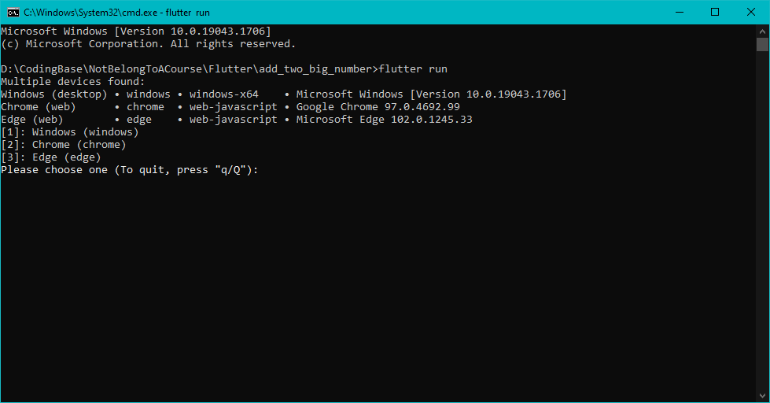
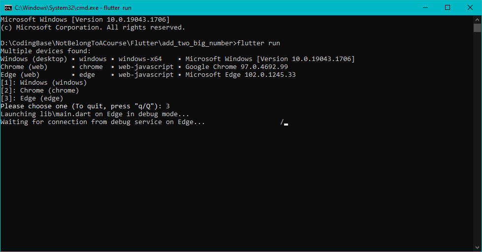
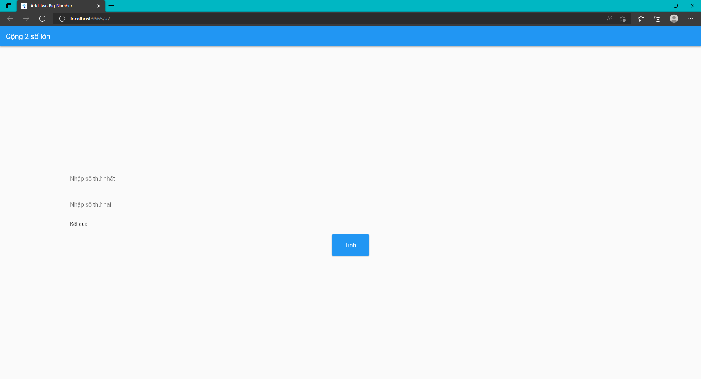

# add_two_big_number

Chương trình cộng 2 số lớn (được biểu diễn dưới dạng chuỗi) cho các học sinh Tiểu học.

## Yêu cầu để chạy mã nguồn

Flutter 3.0.0

Hướng dẫn cài đặt: [Flutter Installation Guide](https://docs.flutter.dev/get-started/install)

## Hướng dẫn chạy mã nguồn

1. Mở Terminal (Command Line) từ thư mục project
2. Chạy lệnh

   ```
   flutter run
   ```

   để chạy chương trình
3. Lúc này flutter sẽ yêu cầu chọn thiết bị để chạy chương trình



4. Chọn thiết bị muốn chạy chương trình bằng cách nhấn số tương ứng



5. Khi chạy thành công sẽ ra được giao diện của ứng dụng



## Hướng dẫn sử dụng

Nhập 2 số vào 2 ô tương ứng và nhấn nút 'Tính' để thực hiện việc tính toán.